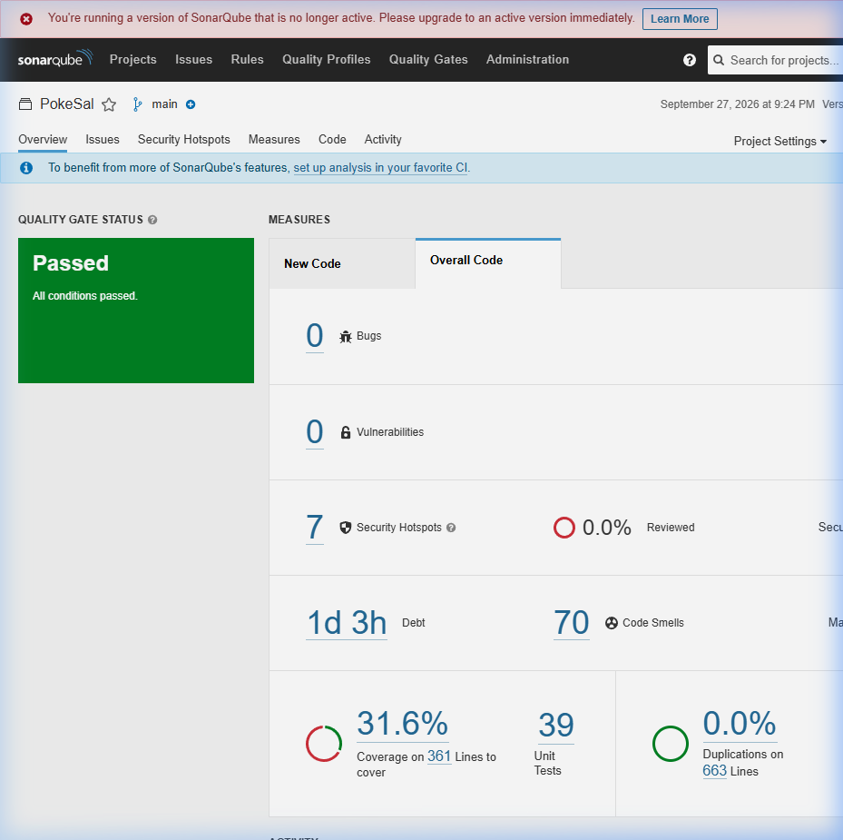
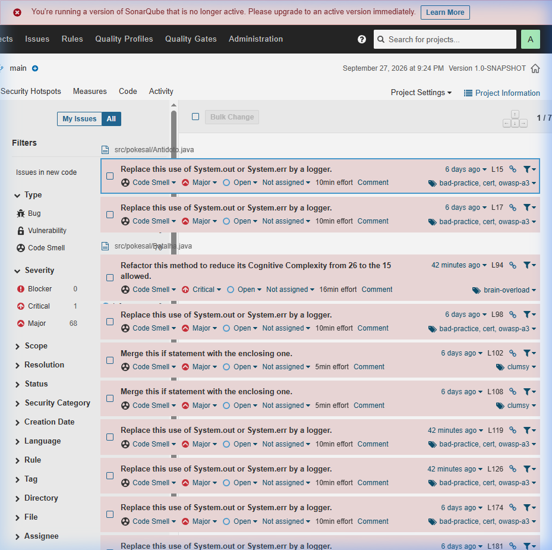
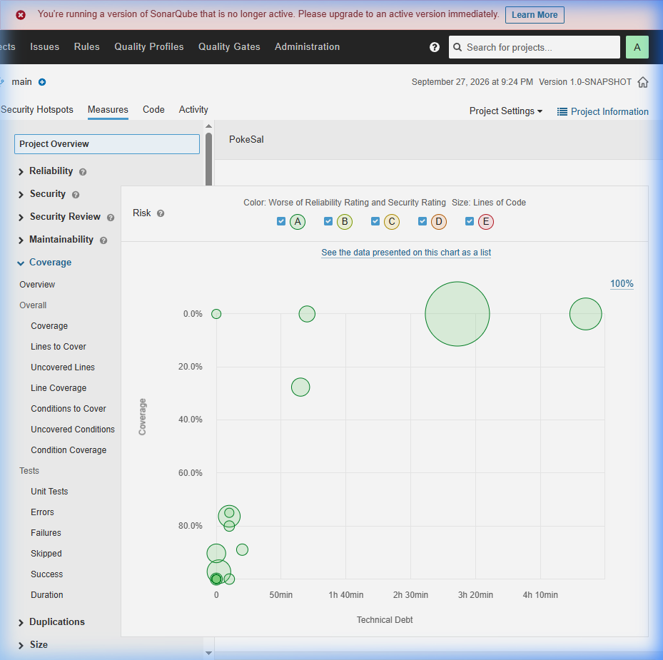
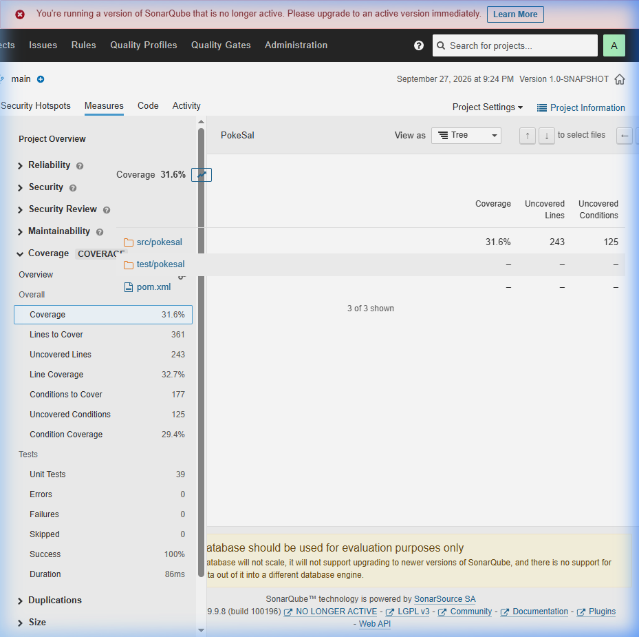

# Relatório de Análise Estática - SonarQube

**Projeto:** PokeSal  
**Data da Análise:** 27/09/2026  
**Ferramenta:** SonarQube Server 9.9.8 (Community Edition)  
**Perfil de Qualidade:** Sonar way (Java)  

---

## 1. Resumo Executivo

A análise estática do projeto PokeSal foi realizada utilizando o SonarQube integrado com JaCoCo para cobertura de código. O projeto **passou no Quality Gate** com todas as condições satisfeitas.

---

## 2. Métricas Obrigatórias

| Métrica | Valor | Rating |
|---------|-------|--------|
| **Bugs** | 0 | A ✅ |
| **Vulnerabilities** | 0 | A ✅ |
| **Code Smells** | 70 | — |
| **Coverage %** | 31.6% | — |

### Quality Gate: ✅ PASSED

---

## 3. Detalhamento das Métricas

### 3.1 Bugs — 0 (Rating A)

Nenhum bug foi identificado pelo SonarQube na análise do código-fonte. Isso indica que o código não apresenta erros de lógica detectáveis pela ferramenta de análise estática.

### 3.2 Vulnerabilities — 0 (Rating A)

Nenhuma vulnerabilidade de segurança foi encontrada no código. O projeto não apresenta riscos de segurança identificáveis pela análise estática.

> **Observação:** Foram identificados **7 Security Hotspots** (0.0% revisados). Security Hotspots são pontos sensíveis do código que requerem revisão manual para determinar se representam uma vulnerabilidade real.

### 3.3 Code Smells — 70

Foram identificados 70 code smells (problemas de manutenibilidade), distribuídos por severidade:

| Severidade | Quantidade |
|------------|-----------|
| Critical | 1 |
| Major | 68 |
| Minor | 1 |
| **Total** | **70** |

**Débito técnico estimado:** 1 dia e 3 horas para resolver todos os code smells.

Os code smells são indicadores de que o código pode ser melhorado em termos de legibilidade, manutenibilidade e boas práticas de programação, mas não representam bugs ou vulnerabilidades.

### 3.4 Coverage — 31.6%

A cobertura de código foi mensurada através do plugin JaCoCo, integrado ao SonarQube:

| Tipo de Cobertura | Valor | Detalhes |
|-------------------|-------|----------|
| **Cobertura Geral** | 31.6% | — |
| Cobertura de Linhas | 32.7% | 361 linhas a cobrir, 243 não cobertas |
| Cobertura de Condições | 29.4% | 177 condições a cobrir, 125 não cobertas |

---

## 4. Métricas Complementares

| Métrica | Valor |
|---------|-------|
| Linhas de Código (ncloc) | 663 |
| Testes Unitários | 39 |
| Taxa de Sucesso dos Testes | 100% (0 erros, 0 falhas) |
| Duplicação de Código | 0.0% |
| Security Hotspots | 7 |
| Arquivos Analisados | 23 |

---

## 5. Screenshots do Dashboard

### 5.1 Visão Geral do Dashboard

### 5.2 Lista de Issues (Code Smells)

### 5.3 Métricas de Cobertura

### 5.4 Detalhes de Cobertura por Arquivo

---

## 6. Conclusão

A análise do SonarQube demonstra que o projeto PokeSal possui:

- **Confiabilidade alta (Rating A):** Nenhum bug identificado.
- **Segurança alta (Rating A):** Nenhuma vulnerabilidade de segurança.
- **70 Code Smells:** Indicando oportunidades de refatoração para melhorar a manutenibilidade do código, com débito técnico estimado em 1 dia e 3 horas.
- **Cobertura de 31.6%:** Os 39 testes unitários cobrem aproximadamente um terço do código, com taxa de sucesso de 100%.
- **Sem duplicação de código:** O projeto não apresenta trechos de código duplicados.

O projeto **passou no Quality Gate** do SonarQube, atendendo a todas as condições mínimas de qualidade exigidas pelo perfil "Sonar way".
